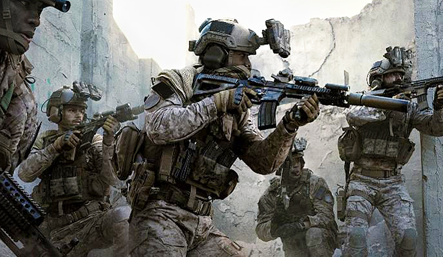

```{r, include = FALSE}
knitr::opts_chunk$set(
  collapse = TRUE,
  comment = "#>",
  out.width = "100%"
)
```

# Call of Duty Modern Warfare Shiny Tracker

<!-- badges: start -->
[](https://www.tidyverse.org/lifecycle/#experimental)
[](http://www.repostatus.org/#wip)
<!-- badges: end -->

***

<center>

Copyright **DocZees** Regiment, All Rights Reserved, 2020  
Author: Jimmy Briggs - Regiment Officer - Email: <jimbrig2011@gmail.com>  
Last compiled on **`r format(Sys.Date(), '%B %d, %Y')`**  

***

</center>

**CODMW** is an R Package housing the code base for the stat tracking shiny application 
for use by the **DocZees Regiment**.


<center>

</center>

### Overview

### Demo

### Installation

### Regiment

### Roadmap

### Contributing

Please note that the 'codmw' project is released with a
[Contributor Code of Conduct](CODE_OF_CONDUCT.md).
By contributing to this project, you agree to abide by its terms.


