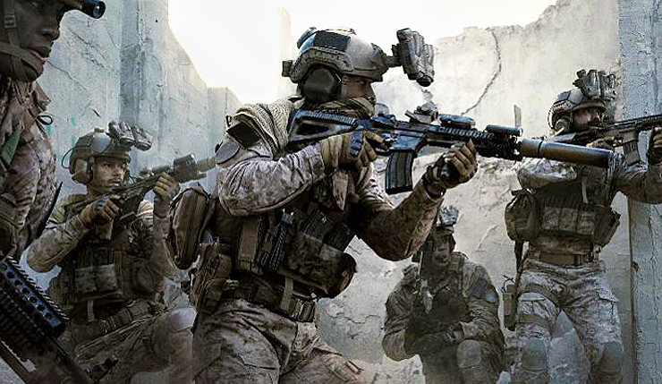

-----

# Call of Duty Modern Warfare Shiny Tracker

Copyright **DocZees** Regiment, All Rights Reserved, 2020  

Author: Jimmy Briggs - Regiment Officer - Email: <jimbrig2011@gmail.com>  

Last compiled on **March 26, 2020** 

***

**CODMW** is an R Package housing the code base for the stat tracking
shiny application for use by the **DocZees Regiment**.

-----

### Regiment

Munchy (Officer) 

Noobith (Officer) 

KimithJongith (Officer) 

***

Beej (Captain)  

Hobo (Captain)

***

Penguin (Soldier) 

Peaky (Soldier) 

***

Tigers (N00bait)  

Bus (N00bait) 

***

### Contributing

Please note that the ‘codmw’ project is released with a [Contributor
Code of Conduct](CODE_OF_CONDUCT.md). By contributing to this project,
you agree to abide by its terms.

